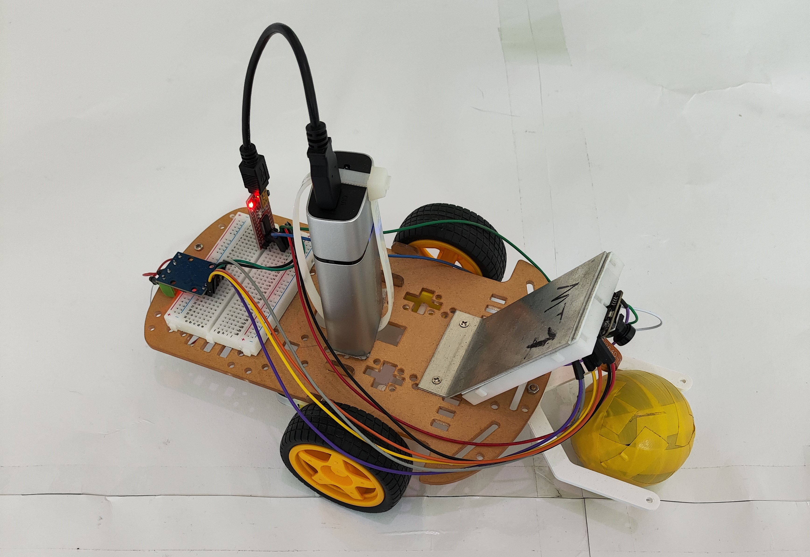

# football-car-computer-vision

## Project Description

This project explores three different approaches to make an ESP32-Arduino car playable using a Java-based programming language. The project initially focused on programming a pair of fully automated football robots, but later expanded to include two additional methods of playing football using robots.

1. Autonomous Self-Driving Car

The autonomous self-driving car utilizes multiple computer vision algorithms to extract information from a single camera and control the vehicle's motors. The car can detect a defined ball, identify the boundaries of the field, and shoot the ball into the goal. The code for this project can be found in the `CaptureJavaRT2022_Autonomous` folder.

2. Controlling with Joystick

By leveraging the Game Control Plus library in Processing, you can control the ESP32 vehicle using a joystick. The code for this project can be found in the `CaptureJavaRT2022_Joystick` folder.

3. Controlling with VR on Android

Processing provides Android development capabilities within the application. By utilizing the rotation vector as the main sensor, you can calculate the position of the vehicle and control the motor. The code for this project can be found in the `CaptureJavaRT2022_VR` folder.

## Requirements

- ESP32-based vehicle with 2 motors
- ESP32 board and software installation instructions (in German) can be found [here](http://www.kramann.info/05_esp32AV/index.php)
- Processing software installation is required to run all the projects. You can download it from [here](https://processing.org/download)
- Each project has its own specific installation procedure, which can be found in the documentation (documentation in progress).

## Documentation

Documentation is currently in progress. Please check back later for updated documentation.

